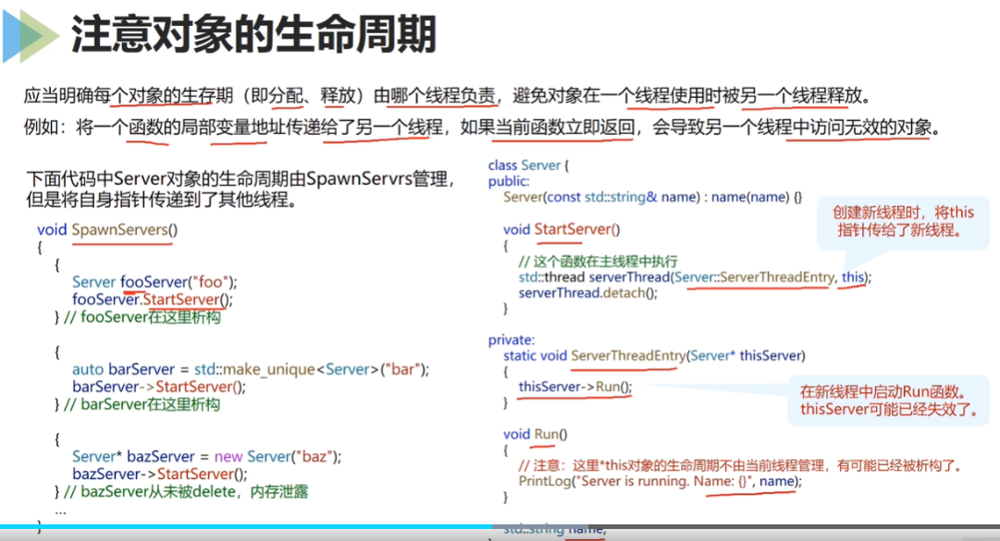

置顶：修改字体颜色等   https://blog.csdn.net/qq_43732429/article/details/108034518


## 异常的抛出与捕获

1. 抛异常时，应该抛对象本身而不是指向对象的指针
2. 捕获异常时，以左值引用的形式捕获异常
3. catch的顺序是先不获派生类，后捕获基类。否则后面的catch永远不会被执行到。
4. 函数不应抛出异常时，应使用noexpect关键字声明


<table><tr><td bgcolor=MistyRose><center><font color=PaleVioletRed size=3>对象切片<font color=red><center></td></tr></table>

《对象切片》

`问题说明`：对于声明按值传递的形参，传入的任何派生类型对象的派生特征都会被截切掉。

当一个函数的参数是**按值传递**的，且传递的对象类型是**基类**。
当调用该函数时，传入派生类对象时，会自动向上转型，将对象转换成基类对象，并删除派生类中新增的任何特性

```C
class Animal{		//基类
private:
	int weight;
public:
	virtual void eat(){
		cout << "eat" << endl;
	}
};
class People : public Animal{		//派生类
private:
	string language;
public:
	void eat(){
		cout << "chi huo" << endl;
	}
};
void fun(Animal a){		//基类 值传递
	a.eat();
}
int main(){
	People me;
	fun(me);  // eat
	return 0;
}
```

`结论`：C++的基类型不适合按值传递，因为按值传递可能回到切片问题。

`原因`：当按值传递时，基类的构造函数被调用，该构造函数初始化的虚函数指针VPTR指向基类的虚函数表VTABLE，并且只拷贝基类部分。

`解决办法`：定义基类的虚函数为**纯虚函数**。当基类中的虚函数为纯虚函数时，则不允许自动转型。因为含有纯虚函数的类不能创建对象，就避免非指针、引用形式的向上类型转换 （对象切片）。


## 模板与泛型编程

<table><tr><td bgcolor=MistyRose><center><font color=PaleVioletRed size=3>代码膨胀<font color=red><center></td></tr></table>

《代码膨胀》

`问题说明`：

模板的另一个重要缺点是其所带来的**代码膨胀**。代码膨胀可以分为两种情况：

- 源代码的增加
- 编译生成目标代码尺寸的增加


`解决办法`：在设计类模板时，仔细分析所有的成员函数，将与类型物馆的操作提取出来，设计一个与模板参数物馆的基类，再将模板类中与模板参数无关的成员变量以及函数都提升到基类中实现。这样，各个类模板实例所调用的都是共同基类中的成员函数，就不会重复生成等价的函数实例。

具体参考：https://blog.csdn.net/zhizhengguan/article/details/113384008


## 并发与并行





## 继承自C语言编程规范条款

**宏定义**

1. 宏定义时，要使用完备的括号

2. 包含多条语句的函数式宏放在do-while(0)中包装

   > 使用do{...}while(0)构造后的宏定义不会受到大括号、分号等的影响，总是会按你期望的方式调用运行。

3. 宏定义不应该依赖宏外部的局部变量名

4. 宏定义不以分号结尾

5. 函数式宏定义中慎用return、goto、continue、break等改变程序流程的语句

**变量**

1. 避免大量栈分配

   1.1 局部变量大小超过1k时，要审视合理性

   1.2 较大的类型作为函数参数时，应使用引用或指针

   1.3 避免使用递归，控制递归深度

**控制语句**

1. 循环必须要安全退出，并正确释放相关资源，避免资源泄露

**指针和数组**

1. 禁止通过对数组类型的函数参数变量进行sizeof来获取数组大小
2. 禁止通过对指针变量进行sizeof来获取数组大小
3. 不同类型的对象指针之间不应进行强制转换

**断言**

1. 禁止用断言检测程序在运行期间可能导致的错误，可能发生的错误要用错误的处理代码来处理

   断言主要用于调试期间，在发布版本中应将其关闭。


