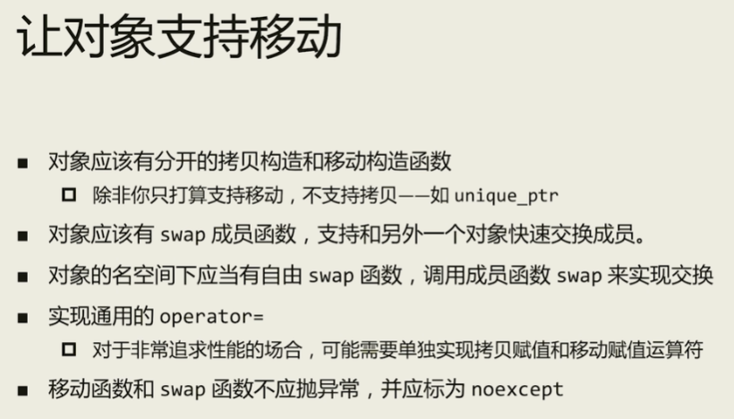
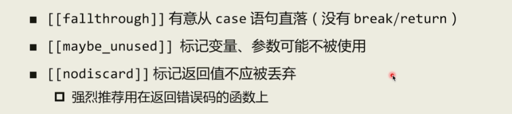

## 关键字

### explicit

用来修饰类的单个参数（**仅有一个参数或除第一个参数外其余参数均有默认值**）的**构造函数**，写在函数名前面，表示不能发生相应的**隐式类型转换**

对于无参数、多参数的构造函数总是显示调用，加explicit无意义

### delete

C++11中，定义成员函数，可在后面使用`= delete`修饰，表示该函数被删除，禁用（该函数未被定义，若再使用该函数编译器将会报错），可用于任何函数；

1.私有构造

​      不希望一个类被拷贝的时候，可以在构造函数前加`private`，c++11中，只需要在构造后添加`= delete`修饰即可；

2.禁止隐式转换


### auto

自动类型推导

vector<int>::iterator it = v.begin()   ---->    auto it = v.begin()

auto c=42;    

` typeid(n).name()`;      // 获取数据类型， 这里输出 i ，表示int

​											//   “PKc” ：pointer 、 const、 char


**auto 和 指针：**

​		<`写不写 *  影响不大`>

​		不管auto后面有没有 *, 如果有的话，会增加一些额外的检查，但语义是不会变的

**auto 和 引用：**

​		<`写不写 & ，会导致不同的结果`>

​		auto a = expr;      值类型

​        const auto&  a = expr;       常左值引用类型，得到的是expr的引用，而非拷贝其内容

​        auto&& a = expr;       很expr值类型相同的引用类型，意味着用expr去匹配一个假想的template<typename T>f(T&&) 函数模板，得到expr的一个转发引用（非右值引用），后续一般应使用std::forward 


### decltype

用于类型推导，对于一个给定的变量或表达式，使用decltype可以得到其类型;

- decltype的自动类型推断会发生在编译阶段，和auto一样
- decltype不会直接计算表达式的值
- decltype后面跟的表达式是左值或者右值时，编译器分析的类型会有所不同。如果表达式（非单个变量）的求值结果是左值，则编译器会得到一个引用类型；如果表达式（非单个变量）的求值结果是右值，则编译器会得到一个与表达式相同的类型

（1） 基本用法

​			根据变量类型或函数返回值类型推断

```C++
int getSize();int main(void){    
	int tempA = 2;        
	/*1.dclTempA为int.*/    d
	ecltype(tempA) dclTempA;    
	/*2.dclTempB为int，对于getSize根本没有定义，但是程序依旧正常，因为decltype只做分析，并不调⽤getSize().*/    
	decltype(getSize()) dclTempB;   
	return 0;
}
```

（2）与const结合

​				保留原const属性

```C++
double tempA = 3.0;    
const double ctempA = 5.0;    
const double ctempB = 6.0；    
 const double *const cptrTempA = &ctempA;        
/*1.dclTempA推断为const double（保留顶层const，此处与auto不同）*/    decltype(ctempA) dclTempA = 4.1;   
/*2.dclTempA为const double，不能对其赋值，编译不过*/    
dclTempA = 5;    
/*3.dclTempB推断为const double * const*/   
decltype(cptrTempA) dclTempB = &ctempA;    
/*4.输出为4（32位计算机）和5*/    
cout<<sizeof(dclTempB)<<"    "<<*dclTempB<<endl;   
/*5.保留顶层const，不能修改指针指向的对象，编译不过*/   
dclTempB = &ctempB;   
/*6.保留底层const，不能修改指针指向的对象的值，编译不过*/    
*dclTempB = 7.0;
```

（3）与引用相结合

​			两种方法：

​						参数直接为引用类型的变量或常量

​						双层括号，括号内为普通变量，仍表示在普通变量类型的基础上加引用

```C++
int tempA = 0, &refTempA = tempA;    
/*1.dclTempA为引⽤，绑定到tempA*/    
decltype(refTempA) dclTempA = tempA;    
/*2.dclTempB为引⽤，必须绑定到变量，编译不过*/    
decltype(refTempA) dclTempB = 0;    
/*3.dclTempC为引⽤，必须初始化，编译不过*/    
decltype(refTempA) dclTempC;    
/*4.双层括号表⽰引⽤，dclTempD为引⽤，绑定到tempA*/    
decltype((tempA)) dclTempD = tempA;        
const int ctempA = 1, &crefTempA = ctempA;        
/*5.dclTempE为常量引⽤，可以绑定到普通变量tempA*/  
decltype(crefTempA) dclTempE = tempA;  
/*6.dclTempF为常量引⽤，可以绑定到常量ctempA*/  
decltype(crefTempA) dclTempF = ctempA;    
/*7.dclTempG为常量引⽤，绑定到⼀个临时变量*/    
decltype(crefTempA) dclTempG = 0;   
/*8.dclTempH为常量引⽤，必须初始化，编译不过*/   
decltype(crefTempA) dclTempH;    
/*9.双层括号表⽰引⽤,dclTempI为常量引⽤，可以绑定到普通变量tempA*/    decltype((ctempA))  dclTempI = ctempA;
```


## 概念

### 直接/间接初始化

https://www.cnblogs.com/apocelipes/p/14415033.html

#### 直接初始化

显式调用类的构造函数

```C++
struct A {
    A() = default;
    A(const A&) = default;
    A(int) {}
};
// 这是默认初始化: A a; 注意区分
A a1{}; // c++11的列表初始化
// 不能写出A a2()，因为这会被认为是函数声明
A a2(1);
A a3(a2); // 显式调用复制构造函数也是直接初始化
auto a4 = static_cast<A>(1);   //直接初始化
```


### 隐式类型转换

**优点：**

​	有时候会提供便捷，比如指针类型的变量可以直接在if语句中和bool类型的变量比较，或者可以把char型字符数组自动转换成字符串string，int类型和char类型转换

**缺点：**

​	可能会产生意想不到的结果

**产生：**

- operator隐式类型转换，将当前对象生成其他类型的对象
- 构造函数的隐式类型转换，用其他类型来构造当前类型的临时对象

```C++
class obj{
public:
    int m_a;
    obj(int num):m_a(num){
        cout<<"自定义构造"<<endl;;
    }
    operator int() const { 
        cout<<"类型转换运算符"<<endl;
        return m_a; 
    }
    ~obj()
    {
        cout<<"析构"<<endl;
    }
};
int main()
{
    obj A=2;  //隐式转换，调用自定义构造函数，生成m_a=2的临时对象
    int a=A;  //调用类型转换运算符
    return 0;
}
```


### RVO、NRVO

#### RVO

- RVO（Return Value Optimization） 返回值优化

- 一种编译器优化技术，消除函数返回时创建的临时变量，可以把通过函数返回创建的临时对象给”去掉“，达到减少拷贝构造或移动构造调用的目的。

- 它是C++11标准的一部分。

  如果编译器明确知道函数会返回哪一个局部对象，那么编译器会把存储这个局部对象的地址和存储返回值临时对象的地址进行复用，也就是说避免了从局部对象到临时对象的拷贝操作

```C++
class Buffer{
public:
    Buffer(){
        buf = new char[100];
        cout<<"构造函数"<<endl;
    }
    Buffer(const Buffer &bbuf){
        // if(buf!=nullptr)
        //     delete[] buf;
        buf = new char[100];
        *buf = *bbuf.buf;
        cout<<"拷贝构造函数"<<endl;
    }
    Buffer& operator=(const Buffer &bbuf){
        // if(buf!=nullptr)
        //     delete[] buf;
        buf = new char[100];
        *buf = *bbuf.buf;
        cout<<"=运算符重载"<<endl;
        return *this;
    }
    Buffer(Buffer &&bbuf) noexcept:buf(bbuf.buf)
    {
        bbuf.buf=nullptr;
        cout<<"移动构造函数"<<endl;
    }
    Buffer& operator=(Buffer &&bbuf) noexcept
    {
        delete[] buf;
        buf = bbuf.buf;
        bbuf.buf = nullptr;
        return *this;
        cout<<"移动赋值函数"<<endl;
    }
    ~Buffer(){
        delete[] buf;
        cout<<"析构函数"<<endl;
    }
public:
    char* buf;
};

Buffer getBuffer(){
    Buffer buf;
    cout<<"getBuffer: "<<&buf<<endl;
    return buf;
}

void setBuffer(Buffer &buf){
    cout<<"setBuffer: "<<&buf<<endl;
}
void setBuffer2(const Buffer &buf){
    cout<<"setBuffer2: "<<&buf<<endl;
}

int main()
{
    Buffer buf = getBuffer();
    setBuffer(buf);
    return 0;
}
```

==== 上述代码在开打RVO的情况下，即正常编译运行，输出结果为

​		构造函数
​		getBuffer: 0x61fe08
​		setBuffer: 0x61fe08
​		析构函数

====  关闭RVO（使用 g++ .\hello.cpp -o hello -fno-elide-constructors编译），运行结果为：

​		构造函数
​		getBuffer: 0x61fdb8
​		移动构造函数    （如果没有定义移动构造，这里会调用拷贝构造函数）
​		析构函数
​		移动构造函数    （如果没有定义移动构造，这里会调用拷贝构造函数）
​		析构函数
​		setBuffer: 0x61fe00
​		析构函数		

#### NRVO

- Named Return Value Optimization    命名返回值优化
- 省略命名对象的拷贝


### 右值引用相关

#### 坍缩规则（引用折叠）

​      模板函数中使用 T&& 不一定能进行右值引用，当传入左值时，此函数的引用将被推导为左值。更准确的讲， **无论模板参数是什么类型的引用，当且仅当实参类型为右引用时，模板参数才能被推导为
右引用类型**。

| 函数形参类型 | 实参参数类型  | 推导后函数形参类型 |
| :----------: | :-----------: | :----------------: |
|      T&      | T&    左引用  |         T&         |
|      T&      | T&&    右引用 |         T&         |
|     T&&      | T&    左引用  |         T&         |
|     T&&      | T&&    右引用 |        T&&         |


#### 万能引用

- 置顶的个人理解：根据坍缩规则，如果将函数形参类型写伪T&&时，实参是什么类型，最后结果就是什么类型，能保证和输入的实参类型一致。

表达形式： 涉及到类型推到的 T&&

- 函数模板的形参

  ​	template<typename T>
  ​	void f(T&& param);

- auto声明

  ​	auto&& var2 = var1;

注意事项：

- const会剥夺一个引用成为万能引用的资格，会被打回原形，成为右值引用
- 判断当前有没有类型推导

```C++
template<typename T>
void f1(std::vector<T>&& param); // param是一个右值引用
template<typename T>
void f2(const T&& param);      //param也是一个右值引用   
```


#### 完美转发

​      **std::forward**通常是用于完美转发的，它会将输入的参数原封不动地传递到下一个函数中，这个“原封不动”指的是，如果输入的参数是左值，那么传递给下一个函数的参数的也是左值；如果输入的参数是右值，那么传递给下一个函数的参数的也是右值。一个经典的完美转发的场景是：

```C++
template <class... Args>
void forward(Args&&... args) {
    f(std::forward<Args>(args)...);
}
```

- **std::forward的实现**

```C++
template<typename T>
constexpr T&& forward(typename std::remove_reference<T>::type& t)noexcept
{
   return static_cast<T&&>(t);
}
```

根据以下实例进行分析：

```C++
template <typename T>
void foo(T&& f){
  std::forward<T>(f)
}

int i=7;
foo(i);
foo(47);
```

在foo(i)， 如果传入的是一个左值， 那么foo中T的类型将是int&, f类型是int& &&, 经过折叠为int&. 因此,最终std::forward最终被实例化如下：

```cpp
int& forward(int &t){
   return static_cast<int&>(t);
}
```

因此可以发现，函数什么都不用做， 最终的传入forward的左值引用被保留了。

在foo(47)中， 传入的是一个右值，那么foo中T的类型将是int, f类型是T&&, 因此，因此,最终std::forward最终被实例化如下：

```cpp
int &&forward(int &&t){
   return static_cast<int &&>(t);
}
```

通过以上分析， 实际上无论传递左值还是右值， forward都可以完美转发， 并且函数内部什么都不用做。


## 实现

### 智能指针

#### unique_ptr

```C++
#include<iostream>
#include<vector>
#include <memory>
using namespace std;

class Shape{
public:
    Shape(){}
    Shape(int w,int h):weight(w),hight(h){}
    void GetShape(){
        cout<<"weight="<<weight<<endl;
        cout<<"hight="<<hight<<endl;
    }
private:
    int weight;
    int hight;
};

template <typename T>
class smart_ptr{
public:
    //构造函数
    explicit smart_ptr(T* ptr = nullptr):ptr_(ptr){}
    //禁用拷贝和赋值
    smart_ptr(const smart_ptr&) = delete;
    smart_ptr& operator=(const smart_ptr&) = delete;

    // smart_ptr(smart_ptr& other){
    //     ptr_=other.release();
    //     cout<<"smart_ptr(smart_ptr& other)"<<endl;
    // }
    // smart_ptr& operator=(smart_ptr& rhs){
    //     //构造新的smart_ptr对象与this对象交换，
    //     smart_ptr(rhs).swap(*this);    //拷贝(移动)+交换 的惯用 ，是一种标准的、能够保证异常安全的惯用方法
    //     cout<<"smart_ptr& operator=(smart_ptr& rhs)"<<endl;
    //     return *this;
    // }
    //移动构造函数
    smart_ptr(smart_ptr&& other){
        ptr_=other.release();
        cout<<"smart_ptr(smart_ptr&& other)"<<endl;
    }
    smart_ptr& operator=(smart_ptr rhs){
        //构造新的smart_ptr对象与this对象交换，
        rhs.swap(*this);    //拷贝(移动)+交换 的惯用 ，是一种标准的、能够保证异常安全的惯用方法
        cout<<"smart_ptr& operator=(smart_ptr rhs)"<<endl;
        return *this;
    }
    
    //子类指针向基类指针的转换
    template <typename U>
    smart_ptr(smart_ptr<U>&& other){
        ptr_ = other.release();
    }
    
    T& operator*() const {return *ptr_;}
    T* operator->() const {return ptr_;}
    operator bool() const {return ptr_;}
    ~smart_ptr(){
        delete ptr_;
    }
    T* get() const{
        return ptr_;
    }
private:
    T* ptr_;
    //u.release()   u 放弃对指针的控制权，返回指针，并将 u 置为空
    T* release(){
        T* ptr = ptr_;
        ptr_ = nullptr;
        return ptr;
    }
    void swap(smart_ptr& rhs){
        using std::swap;
        swap(ptr_,rhs.ptr_);
    }
};

int main(){
    Shape rect(2,3);
    smart_ptr<Shape> p(new Shape(4,5));
    p->GetShape();
    smart_ptr<Shape> p2(move(p));
    smart_ptr<Shape> p3 = p2;	//报错   
    smart_ptr<Shape> p3 = move(p2);		//通过
    p2->GetShape();
    p->GetShape();		//报错   p已经指向空

    unique_ptr<Shape> u = make_unique<Shape>(10,10);
    unique_ptr<Shape> u2(move(u));
    u2->GetShape();
    u->GetShape();	//报错   p已经指向空
    return 0;
}
```


#### shared_ptr





```C++
class shared_count{
public:
    long use_count_;
public:
    shared_count(long count = 1):use_count_(count){}
    long add_count(){
        ++use_count_;
        return use_count_;
    }
    long reduce_count(){
        --use_count_;
        return use_count_;
    }
};


template <typename T>
class share_smart_ptr:public shared_count{
public:
    explicit share_smart_ptr(T*ptr = nullptr): ptr_(ptr){
        if(ptr)
            share_count_ = new shared_count();
    }

    /**
    除了要提供模板化的"拷贝构造"以外，还要提供一个非模板的拷贝构造
    原因：C++认为模板化的"拷贝构造"不是真正的拷贝构造函数，因此会默认提供一个拷贝构造函数，但这个函数是错的，不会进行引用计数的修改
    因此，必须实现一个非模板的拷贝构造函数
    但，并不需要提供一个非模板的移动构造
    原因：C++规则，如果提供了拷贝构造函数，编译器便默认不会提供移动构造，这时候，模板化的移动构造便成为提供右值引用的最佳匹配
     */
    share_smart_ptr(const share_smart_ptr &other){
        ptr_ = other.ptr_;
        if(ptr_){
            other.share_count_->add_count();
            share_count_ = other.share_count_;
        }
    }

    //模板化的"拷贝构造"
    template <typename U>
    share_smart_ptr(const share_smart_ptr<U> &other){
        ptr_ = other.ptr_;
        if(ptr_){
            other.share_count_->add_count();
            share_count_ = other.share_count_;
        }
    }

    //模板化的移动构造函数
    template <typename U>
    share_smart_ptr(share_smart_ptr<U> && other) noexcept{
        ptr_ = other.ptr_;
        if(ptr_){
            share_count_ = other.share_count_; //先把引用计数的指针先拿过来
            other.ptr_=nullptr;
        }
    }

    T& operator*() const {return *ptr_;}
    T* operator->() const {return ptr_;}
    operator bool() const {return ptr_;}

    ~share_smart_ptr(){
        if(ptr_ && !share_count_->reduce_count()){
            delete ptr_;
            delete share_count_;
        }
    }

public:
    shared_count* share_count_;
private:
    T* ptr_;
    void relese(){
        if((--share_count_->use_count_)==0){
            delete ptr_;
            delete share_count_;
        }
    }
};


int main()
{
    share_smart_ptr<Shape> s(new Shape(1,2));
    s->GetShape();
    cout<<"s.use_count_ = "<<s.share_count_->use_count_<<endl;

    {
        share_smart_ptr<Shape> s2 = s;
        s2->GetShape();
        cout<<"s2.use_count_ = "<<s2.share_count_->use_count_<<endl;
    }
    
    cout<<"s.use_count_ = "<<s.share_count_->use_count_<<endl;

    return 0;
}
```


#### make_shared

​		make_shared函数的主要功能是在[动态内存](https://so.csdn.net/so/search?q=动态内存&spm=1001.2101.3001.7020)中分配一个对象并初始化它，返回指向此对象的shared_ptr;由于是通过shared_ptr管理内存，因此一种安全分配和使用动态内存的方法。直接通过原生指针去赋值微存在一些内存泄漏上的风险

使用：

```C++
shared_ptr<string> p1 = make_shared<string>(10, '9');  
shared_ptr<string> p2 = make_shared<string>("hello");   
auto = make_shared<string>();
```

make_shared是组合使用可变参数模板与forward（转发）机制实现将实参保持不变地传递给其他函数。如最开始的string例子。

1）**使用可变参数**：是因为string有多个构造函数，且参数各不相同；

2）Args参数为**右值引用(Args&&)**和**std::forward**：是为了保持实参中类型信息的传递。这样当传递一个右值string&& 对象给make_shared时，就可以使用string的移动构造函数进行初始化。注意，两者必须结合使 用，缺一不可；此外std::forward<_Args>(__args)...是采用包扩展形式调用的

实现：

```C++
template<typename T, typename... Args>
shared_smart_ptr<T> make_shared_wmy(Args&&... args){
    shared_smart_ptr<T> ret(new T(forward<Args>(args)...));
    return ret;
}

auto a = make_shared_wmy<Shape>(3,4);
```


# C++17 新特性

## std::string_view

#### 背景

在日常C/C++编程中，我们常进行数据的传递操作，比如，将数据传给函数。当数据占用的内存较大时，减少数据的拷贝可以有效提高程序的性能。在**C**中指针是完成这一目的的标准[数据结构](https://so.csdn.net/so/search?q=数据结构&spm=1001.2101.3001.7020)，而**C++**引入了安全性更高的引用类型。所以在**C++**中若传递的数据仅仅只读，`const string&`成了**C++**的天然的方式。但这并非完美，从实践来看，它至少有以下**几方面问题**：

1. 字符串字面值、字符数组、字符串指针的传递仍要数据拷贝
   这三类低级数据类型与`string`类型不同，传入时，编译器需要做隐式转换，即需要拷贝这些数据生成`string`临时对象。`const string&`指向的实际上是这个临时对象。通常字符串字面值较小，性能损耗可以忽略不计；但字符串指针和字符数组某些情况下可能会比较大（比如读取文件的内容），此时会引起频繁的内存分配和数据拷贝，会严重影响程序的性能。
2. `substr` **O(n)**复杂度
   这是一个特别常用的函数，好在`std::string`提供了这个函数，美中不足的是其每次都返回一个新生成的子串，很容易引起性能热点。实际上我们本意并不是要改变原字符串，为什么不在原字符串基础上返回呢？

在**C++17**中引入了`string_view`，能很好的解决以上两个问题。	

------------------

#### std::string_view

使用时要添加头文件:	`#include <string_view>`

​		当字符串数据的所有权已经确定(譬如由某个string对象持有)，并且你只想访问(而不修改)他们时，使用 std::string_view 可以**避免字符串数据的复制**，从而提高程序效率。

​		类比数据库的视图，`view`表示该类型不会为数据分配存储空间，而且该数据类型只能用来读。该数据类型可通过`{数据的起始指针，数据的长度}`两个元素表示，实际上该数据类型的实例不会具体存储原数据，仅仅存储指向的数据的起始指针和长度，所以这个开销是非常小的。

​		对象拷贝本质上只是赋值指针和长度，是个值语义。因此，使用者需要保证string_view存续期间其指向的字符串一直存在


**string_view 的构造函数和成员函数** 参考：https://blog.csdn.net/xp178171640/article/details/118102994

**成员函数的具体使用方法** 参考：https://blog.csdn.net/tcy23456/article/details/105093594/

成员函数的使用与string较为相似

有几个地方需要特别说明：

1. `string_view`的`substr`函数的时间复杂度是O(1)，而`string`的`substr`是O(n)，解决了背景部分的第二个问题。

   具体对比情况见：https://blog.csdn.net/tkokof1/article/details/82527370

2. **修改器**中的三个函数仅会修改`string_view`的数据指向，不会修改指向的数据。


#### 缺点

不恰当的使用`string_view`也会带来一系列的问题。

1. `string_view`范围内的字符可能不包含`\0`

如

```cpp
#include <iostream>
#include <string_view>

int main() {
    std::string_view str{"abc", 1};
    std::cout << str.data() << std::endl;
    return 0;
}
```

本来是要打印`a`，但输出了`abc`。这是因为字符串相关的函数都有一条兼容C的约定：`\0`代表字符串的结尾。上面的程序打印从开始到字符串结束的所有字符，虽然`str`包含的有效字符是`a`，但`cout`认`\0`。好在这块内存空间有合法的字符串结尾符，如果`str`指向的是一个没有`\0`的字符数组，程序很有可能会出现内存问题，所以我们在将`string_view`类型的数据传入接收字符串的函数时要非常小心。

2. 从`[const] char*`构造`string_view`对象时间复杂度`O(n)`
   这是因为获取字符串的长度需要从头开始遍历。如果对`[const] char*`类型仅仅是一些`O(1)`的操作，相比直接使用`[const] char*`，转为`string_view`是没有性能优势的。只不过是相比`const string&`，`string_view`少了拷贝的损耗。实际上我们完全可以用`[const] char*`接收所有的字符串，但这个类型太底层了，不便使用。在某些情况下，我们转为`string_view`可能仅仅是想用其中的一些函数，比如`substr`。

3. `string_view`指向的内容的生命周期可能比其本身短

   `string_view`并不拥有其指向内容的所有权，用Rust的术语来说，它仅仅是暂时`borrow`（借用）了它。如果拥有者提前释放了，你还在使用这些内容，那会出现内存问题，这跟`悬挂指针`(dangling pointer)或悬挂引用（dangling references）很像。Rust专门有套机制在编译时分析变量的生命期，保证`borrow`的资源在使用期间不会被释放，但C++没有这样的检查，需要人工保证。下面列出一些典型的问题情况：


总结：所以，推荐的使用方式：**仅仅作为函数参数**，因为如果该参数仅仅在函数体内使用而不传递出去，这样使用是安全的。


## 标准属性



```C++
#include <stdexcept>
using namespace std;

int test1(int c){
    int result = 0;
    switch (c) {
    case 2:
        ++result;
        [[fallthrough]];		//表示有意跳到下一个case语句，不用return
    case 1:
        ++result;
        break;
    default:
        throw runtime_error("bad input");
    }
    return result;
}

[[nodiscard]] bool test2(int a){		//如果调用者没检查返回值，会提示
    [[maybe_unused]] int b = a + 1;		//没有用到的变量
    return true;
}

int main(){
    test1(42);
    test2(42);
}
```


