## 资源管理和对象的基本规则

**栈展开**

一旦异常发生，编译器会调用特殊的代码保证栈上的对象都被析构

参考：https://www.cnblogs.com/cxl-/p/15458343.html

**RAII**

Resource Acquisition Is Initialization

**三法则**

- 定义

  若某个类需要用户定义的析构函数、用户定义的拷贝构造函数或用户定义的拷贝复制运算符，则它几乎肯定三者全部都需要。

**引用语义和值语义**

​	C++一般是值语义，除非显示指定了引用或指针，否则的话不同变量指向不同对象。

值语义的优缺点

优点：

1.  行为简单，符合直觉     

			2. 不容易发生竞争
			2. 数据嵌套时内存相邻，性能高
			2. 对象本身可以分配在栈上，栈上内存的分配释放开销极低

缺点：

1. 容易不小心发生内存复制    深拷贝

   （如何返回复制容器）

## 移动语义与右值引用

### C++的值类别

左值（lvalue）：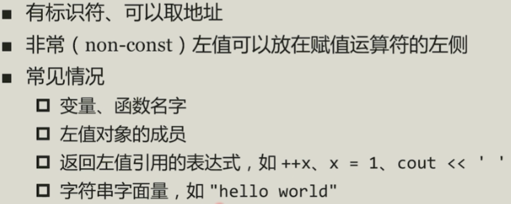

纯右值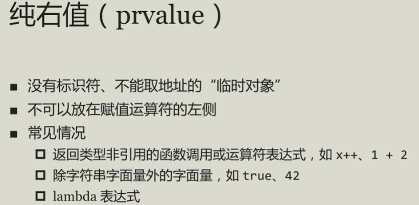

将亡值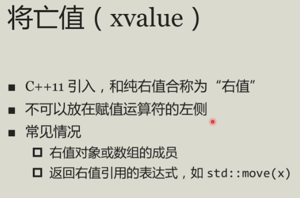

坍缩规则

转发引用（万能引用）--- forword

延长生命周期：

​	让一个常引用指向一个将亡值。那么这个将亡值的生命周期就会被延长到和这个常引用相同的长度

​	const **Buffer** &buf = **Buffer**();

​	临时变量作为函数参数时，参数类型必须是const 引用

## 智能指针

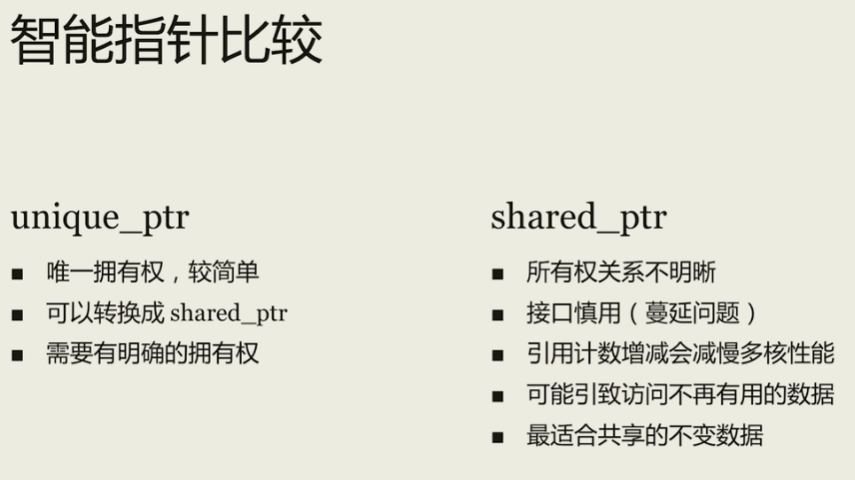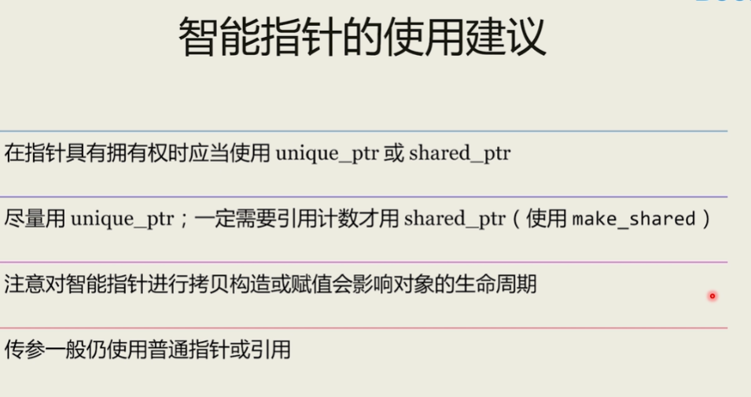

## 容器和类容器

- string
- 序列容器：eg. vector  list
- 关联容器  eg. map
- 无序关联容器   eg. unordered_map
- 容器适配器

### string

1. 不是容器，只能存放字符类型的数据

2. 有跟其它序列容器类似的成员函数（共性）

   - begin、end、empty、size、swap

3. 特点

   - 自动维护字符串的生命周期

   - 支持字符串的拼接操作   +、+=

   - 支持字符串的查找操作  find、rfind

   - 支持给期待const char* 的接口传递字符串内容  c_str

   - 支持到数字的转换 stoi系列函数和to_string

   - size()成员函数时间复杂度是O(1)，而strlen是O(n)

     > sizeof(string)和字符串的长度是无关的，在一个系统中所有的sizeof(string)是一个固定值，这个和编译器相关，string字符串是存储在堆上，这个属于动态分配的空间，对于别的整形浮点型数据类型则没有这个问题
     >
     > 本机上固定值 32

### vector

- 最常用的序列容器
- 大小可变的“动态”数组
- 为尾部增删元素而优化

### 函数对象

在一个类、结构体里面，实现了operator() 这样一个对象，之后可以用()调用operator()这个函数；

函数对象的类型（而非实例）决定了其行为；

sort可以接受函数指针作为参数，而map只能接收函数对象。

## 迭代器和循环

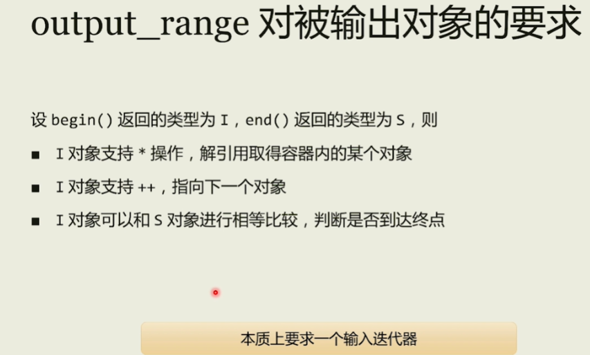

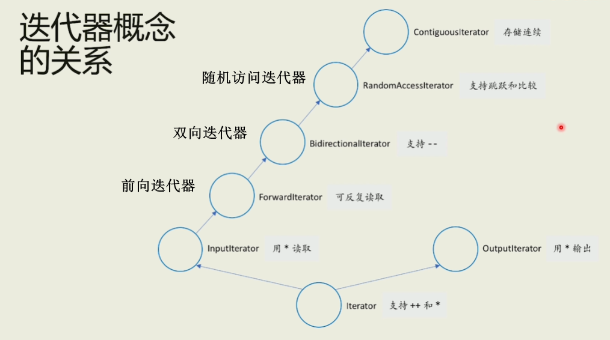

## 对象返回和异常

### 返回值优化和对象返回

- **返回值优化（返回无名对象）RVO** --> 使得在返回对象时没有其他额外的拷贝

- **返回值优化（返回有名对象）NRVO** --> 使得在返回对象时没有其他额外的拷贝

​          虽然在返回对象时没有调用额外的拷贝构造或是移动构造，但在类中，拷贝构造和移动构造函数至少要有一个，不能两个都=delete，这样代码会编译不过。

- **返回值优化（返回多路分支构造函数的对象）**

    在函数中，编译器无法决定会确定返回哪个分支对象，因此就不可能直接在分支位置完成构造。

    这种情况，在返回对象时就会调用移动构造(优先)或拷贝构造函数。

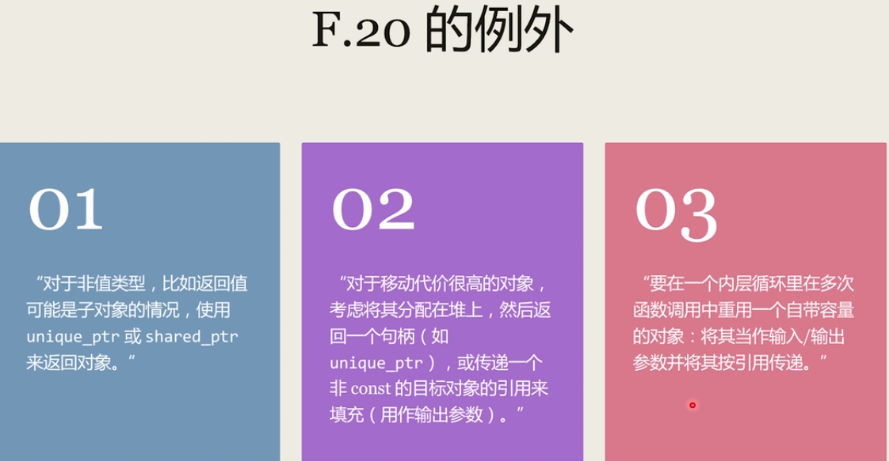

### 异常的得失和相关建议

异常违反了C++的零开销原则（无需为你所不用的付出。），但大大增强了代码的表达能力和可读性。    

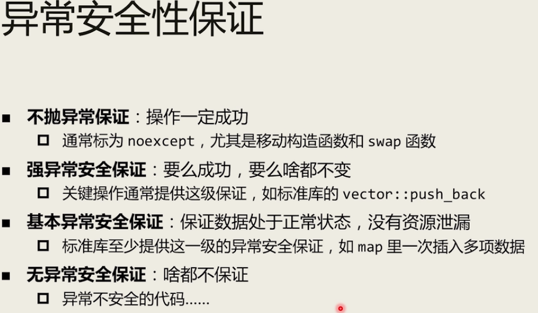

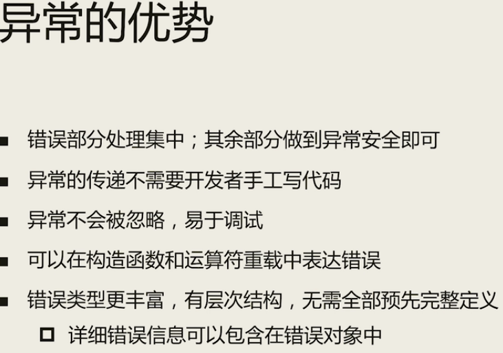

模板类 通常使用异常，而不是错误码

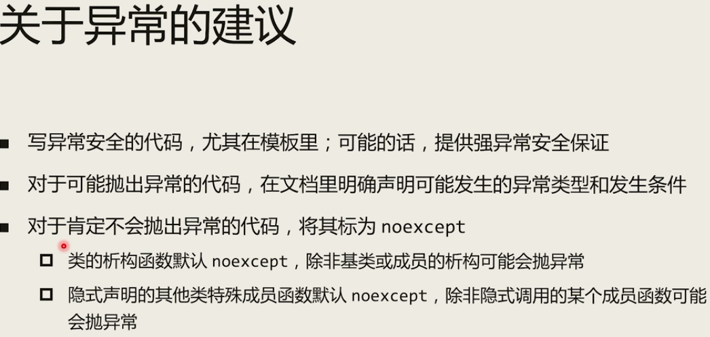

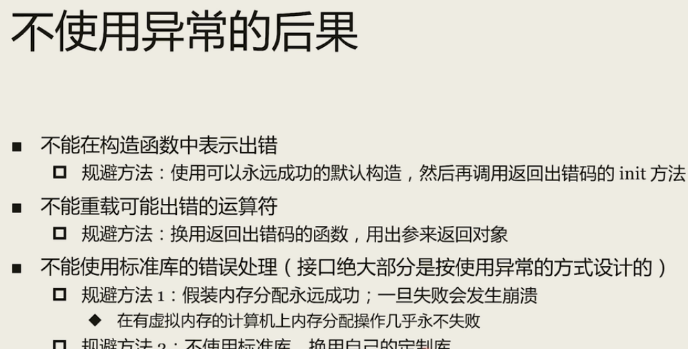

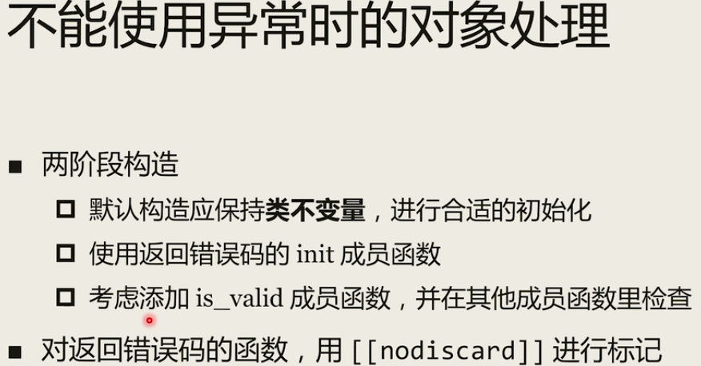

## 语言易用性改进

1. **auto**

    自动类型推导

    vector<int>::iterator it = v.begin()   ---->    auto it = v.begin()

    auto c=42;    

    ` typeid(n).name()`;      // 获取数据类型， 这里输出 i ，表示int

    ​											//   “PKc” ：pointer 、 const、 char

    

    **auto 和 指针：**

    ​		<`写不写 *  影响不大`>

    ​		不管auto后面有没有 *, 如果有的话，会增加一些额外的检查，但语义是不会变的

    **auto 和 引用：**

    ​		<`写不写 & ，会导致不同的结果`>

    ​		auto a = expr;      值类型

    ​        const auto&  a = expr;       常左值引用类型，得到的是expr的引用，而非拷贝其内容

    ​        auto&& a = expr;       很expr值类型相同的引用类型，意味着用expr去匹配一个假想的template<typename T>f(T&&) 函数模板，得到expr的一个转发引用（非右值引用），后续一般应使用std::forward 

2. **declltype**

    

