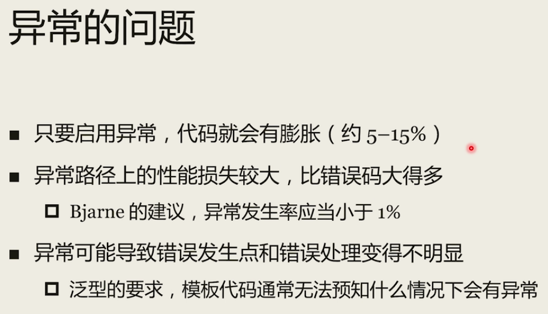

## 资源管理和对象的基本规则

**栈展开**

一旦异常发生，编译器会调用特殊的代码保证栈上的对象都被析构

参考：https://www.cnblogs.com/cxl-/p/15458343.html


**RAII**

Resource Acquisition Is Initialization


**三法则**

- 定义

  若某个类需要用户定义的析构函数、用户定义的拷贝构造函数或用户定义的拷贝复制运算符，则它几乎肯定三者全部都需要。


**引用语义和值语义**

​	C++一般是值语义，除非显示指定了引用或指针，否则的话不同变量指向不同对象。

值语义的优缺点

优点：

​		行为简单，符合直觉     

```
	2. 不容易发生竞争
	2. 数据嵌套时内存相邻，性能高
	2. 对象本身可以分配在栈上，栈上内存的分配释放开销极低
```
缺点：	

​		容易不小心发生内存复制    深拷贝

（如何返回复制容器）


## 移动语义与右值引用

### C++的值类别

左值（lvalue）：

纯右值

将亡值


坍缩规则

转发引用（万能引用）--- forword


延长生命周期：

​	让一个常引用指向一个将亡值。那么这个将亡值的生命周期就会被延长到和这个常引用相同的长度

​	const **Buffer** &buf = **Buffer**();

​	临时变量作为函数参数时，参数类型必须是const 引用

## 智能指针


## 容器和类容器

- string
- 序列容器：eg. vector  list
- 关联容器  eg. map
- 无序关联容器   eg. unordered_map
- 容器适配器


### string

1. 不是容器，只能存放字符类型的数据

2. 有跟其它序列容器类似的成员函数（共性）

   - begin、end、empty、size、swap

3. 特点

   - 自动维护字符串的生命周期

   - 支持字符串的拼接操作   +、+=

   - 支持字符串的查找操作  find、rfind

   - 支持给期待const char* 的接口传递字符串内容  c_str

   - 支持到数字的转换 stoi系列函数和to_string

   - size()成员函数时间复杂度是O(1)，而strlen是O(n)

     > sizeof(string)和字符串的长度是无关的，在一个系统中所有的sizeof(string)是一个固定值，这个和编译器相关，string字符串是存储在堆上，这个属于动态分配的空间，对于别的整形浮点型数据类型则没有这个问题
     >
     > 本机上固定值 32


### vector

- 最常用的序列容器
- 大小可变的“动态”数组
- 为尾部增删元素而优化


### 函数对象

在一个类、结构体里面，实现了operator() 这样一个对象，之后可以用()调用operator()这个函数；

函数对象的类型（而非实例）决定了其行为；

sort可以接受函数指针作为参数，而map只能接收函数对象。


## 迭代器和循环


## 对象返回和异常

### 返回值优化和对象返回

- **返回值优化（返回无名对象）RVO** --> 使得在返回对象时没有其他额外的拷贝

- **返回值优化（返回有名对象）NRVO** --> 使得在返回对象时没有其他额外的拷贝


​          虽然在返回对象时没有调用额外的拷贝构造或是移动构造，但在类中，拷贝构造和移动构造函数至少要有一个，不能两个都=delete，这样代码会编译不过。


- **返回值优化（返回多路分支构造函数的对象）**

    在函数中，编译器无法决定会确定返回哪个分支对象，因此就不可能直接在分支位置完成构造。

    这种情况，在返回对象时就会调用移动构造(优先)或拷贝构造函数。


### 异常的得失和相关建议

异常违反了C++的零开销原则（无需为你所不用的付出。），但大大增强了代码的表达能力和可读性。    




模板类 通常使用异常，而不是错误码


## 语言易用性改进

### 自动类型推导和类模板参数

#### auto

自动类型推导

vector<int>::iterator it = v.begin()   ---->    auto it = v.begin()

auto c=42;    

` typeid(n).name()`;      // 获取数据类型， 这里输出 i ，表示int

​											//   “PKc” ：pointer 、 const、 char


**auto 和 指针：**

​		<`写不写 *  影响不大`>

​		不管auto后面有没有 *, 如果有的话，会增加一些额外的检查，但语义是不会变的

**auto 和 引用：**

​		<`写不写 & ，会导致不同的结果`>

​		auto a = expr;      值类型

​        const auto&  a = expr;       常左值引用类型，得到的是expr的引用，而非拷贝其内容

​        auto&& a = expr;       很expr值类型相同的引用类型，意味着用expr去匹配一个假想的template<typename T>f(T&&) 函数模板，得到expr的一个转发引用（非右值引用），后续一般应使用std::forward 


#### declltype

 参考 笔记《名词-关键字_记录》

用于类型推导，对于一个给定的变量或表达式，使用decltype可以得到其类型;

- decltype的自动类型推断会发生在编译阶段，和auto一样
- decltype不会直接计算表达式的值

> **decltype(auto)**
>
> ​	auto 不能自动推导出引用类型
>
> ​	decltype(auto) 用于需要自动得出引用类型的场合
>
> decltype(expr) a = expr;   ===>   decltype(auto) a = expr;


### 类的特殊非静态成员函数和相关易用性改进

#### 类的特殊非静态成员函数

存在下面六个：

​		**默认构造函数**

​			会被隐式声明默认提供，但用户提供了其它的构造函数时，便不会提供默认构造函数了，此时可以通过default关键字要求编译器提供默认构造

```C++
class A{
	A( )=default;
	A(int x) {m_x = x;}
	int m_x;
}；
```

​		**拷贝构造函数**

​				Obj(const Obj&);

​		**拷贝赋值运算符**

​       **移动构造函数**

与拷贝构造函数不用的是，只有当类没有定义拷贝构造函数、拷贝赋值运算符、自购函数且类的每个非static数据都可以哦对那个时，编译器才会为它生成移动构造函数或移动赋值表达式

​		**移动赋值运算符**

​						Obj& operator=（Obj&&）

​		**析构函数**


- 隐式声明或用户声明
- 默认提供、用户提供或被删除
- 不能是函数模板


### 初始化相关易用性改进

#### 列表初始化

vector<int> v{1,2,3};

Obj（int n）：value_(n) {};

##### initializer_list

是C++11提供的新的模板类型，可以使用初始化列表语法将STL容器初始化为一系列值，需要头文件 initializer_list

```C++
template< class T >
class initializer_list;
```

#### 统一初始化

- 统一使用{ } 来变量进行初始化
- 示例
  - int i{}；		   	//默认初始化
  - int j{42};            //用42初始化
  - bool a{};            //默认初始化（false）
  - bool a{true};       //用true初始化
  - string s1；         //调用默认构造函数 string() 初始化
  - string s2{}；         //调用默认构造函数 string() 初始化
  - string s3{“Hello”}；         //调用默认构造函数 string(const char*) 初始化


### 其它易用性改进

#### 用户定义字面量

- 标准库的字面量示例

  ```C++
  "hello"s;          //std::string ("hello")
  "hello"sv;        //std::string_view ("hello")       C++17x
  1s;			//std::chrono::seconds(1)
  100ms;		//std::chrono::milliseconds(100)
  2i;			 //std::complex(0,2)   虚数
  ```


- 用户定义字面量

  自定义时 ` _ `开头

  ```C++
  #include <iostream>  // std::cout/endl
  using namespace std;
  
  struct length {
      double value;
      enum unit {
          metre,
          kilometre,
          millimetre,
          centimetre,
          inch,
          foot,
          yard,
          mile,
      };
      static constexpr double factors[] = {
          1.0,    1000.0, 1e-3,   1e-2,
          0.0254, 0.3048, 0.9144, 1609.344
      };
      explicit length(double v, unit u = metre) {
          value = v * factors[u];
      }
  };
  
  length operator+(length lhs, length rhs){
      return length(lhs.value + rhs.value);
  }
  
  length operator""_m(long double v){
      return length(v, length::metre);
  }
  
  length operator""_cm(long double v){
      return length(v, length::centimetre);
  }
  
  int main()
  {
      auto result = 1.0_m + 10.0_cm;
      cout << "Result is " << result.value << "m\n";
  }
  ```

  

#### 二进制字面量

#### 数字分隔符


#### 指针空值常量nullptr

​		C++11之前，通常使用NULL和0获取一个空指针，空指针是指不会指向有效数据的指针。以前，C++在源代码中使用0表示这种指针，但内部表示可能不同。这带来了一些问题，因为这使得0既可以表示指针常量，又可表示整形常量。

​		所以C++11新增了关键字nullptr，用于表示空指针；它是指针类型，不能转化为整形类型。为向后兼容，C++11仍然允许0来表示空指针，因此表达式nullptr=0为true，但使用nullptr而不是0提供了更高的类型安全。例如，可将0传递给接受int参数的函数，但如果您试图将nullptr传递给这样的函数，编译器将此视为错误。

- 明确的空指针常量，及相关的特别类型（std::nullptr_t）

- 解决0/NULL的二义性
- 可以隐式转换为任意类型的指针或者指向任何成员。
- 不能隐式转换为整型，可以隐式转换为bool类型代表false。
- 可以和除了整型和bool型的其他类型比较。
- 现在C++里常常直接使用nullptr_t（指针空值类型）进行重载（如unique_ptr的构造函数）

```C++
template <typename T>
void foo(T){
    cout << type_id<T>() << '\n';
}

int main()
{
    foo(NULL);		//输出  long   （不一定，看编译器，反正是一个比较意外的结果）
    foo(nullptr);	    //输出 decltype(nullptr)   , 这个就表示nullptr_t
}
```

#### 静态断言 static_assert

C++11新特性

`断言在编译器求值，为假会导致编译失败`

```C++
static_assert ((alignment & (alignment-1))==0),
				"Alignment must be power of two 必须是2的次方");
static_assert (sizeof(void*)==4,
				"Only 32-bit targets are supported");
```


#### override

背景：当基类定义了虚函数，并且子类覆盖了这个虚函数，此时不知道这个函数是不是虚函数，同时不知道是否覆盖成功

- 提高可读性：表示这个函数覆盖了基类的成员函数
- 提供额外检查：防止拼写错误或代码改动导致基类和派生类中的成员函数名称不一致，因为ioverride使用就要求这个是虚函数


使用指南：

​		在基类使用virtual（写在函数返回值前面），在派生类使用override（写在函数参数括号外的后面），两者不同时使用


#### final

- 声明成员函数是一个虚函数，且该虚函数不可再派生类中被覆盖
- 表示某个类或结构不可被派生


使用指南：

​		声明虚函数不可被覆盖时，不和virtual同时使用

​		慎用final，往往不必要并可能损坏可扩展性


#### 标准属性

C++17重要的标准属性


## 部分其它新特性

### using类型别名、顶宽整数类型、

#### using 类型别名

using MacBytes1 = char[6];    // 现在的 using  使用语法改变

typedef char MacBytes2[6];    //以前的


#### 定宽整数类型

#### enum class


#### std::byte

```C++
vector<byte> v1{byte{0x42},byte{0x61},byte{0x64}};
```


#### tuple

- 多元组
- - 固定大小
  - 包含一组异质数据
- pair的推广，常用于函数的多返回值

```C++
using my_tuple = tuple<int,string,string>;
vector<my_tuple> vn {{1,"one","un"},
                     		 {2,"two","deux"},
                     		 {3,"three","trois"}};
get<2>(vn[0]) = "une";      // un --->  une              get 获取元素，得到的是引用，可读可写
```

#### tie

http://www.cplusplus.com/reference/tuple/tie/

创建左值引用的tuple，或将tuple解包为独立对象

使用`std::ignore`忽略某些tuple中的某些返回值    `auto [a,b] = fun()`

使用 tie 的方式对多个元素同时进行赋值

```C++
// packing/unpacking tuples
#include <iostream>     // std::cout
#include <tuple>        // std::tuple, std::make_tuple, std::tie

int main (){
  int myint;
  char mychar;
  std::tuple<int,float,char> mytuple;
  mytuple = std::make_tuple (10, 2.6, 'a');          // packing values into tuple
  std::tie (myint, std::ignore, mychar) = mytuple;   // unpacking tuple into variables      tie无法直接从初始化列表获得值，
  std::cout << "myint contains: " << myint << '\n';
  std::cout << "mychar contains: " << mychar << '\n';
  return 0;
}

/*输出结果*/
myint contains: 10
mychar contains: a
```


#### 时间  chrono


#### 随机数 random

```C++
#include <algorithm>
#include <iostream>
#include <iterator>
#include <random>
#include <vector>

using namespace std;

int main()
{
    // 用系统的随机数初始化 MT19937 伪随机数引擎
    mt19937 engine{random_device{}()};
    // 使用均匀整数分布
    uniform_int_distribution dist{1, 1000};
    vector<int> v;
    v.reserve(100);
    for (int i = 0; i < 100; ++i) {
        // 产生随机数
        v.push_back(dist(engine));
    }
    copy(v.begin(), v.end(), ostream_iterator<int>(cout, " "));
    cout << '\n';
}

```


#### 正则表达式 regex


## 模板基础

### 模板概述、函数模板实例


### 类模板实例

- 模板：函数模板、类模板、变量模板
- 类模板和变量模板支持偏特化
  - 对部分模板参数进行确定，或对模板参数加以约束
- 函数模板没有偏特化（但通常函数可以利用好重载达到类似功能）


## 函数式编程

- 函数对象
- lambda 表达式
- function 模板
- 函数式编程简介


### 函数对象

任何定义了函数调用操作符的对象都是函数对象。

- 函数
  - 函数可以使用（）进行调用
  - 函数在参数传递时通常退化为函数指针
- 函数指针
  - 函数指针可以解引用调用： (*ptr)(...)
  - 函数指针也可以直接调用：ptr（...）
- 定义了operator( ) 成员函数的对象
  - 语法和普通函数一致：obj(...)


### lambda 表达式


- 示例


**基本语法**

简单来说，Lambda函数也就是一个函数，它的语法定义如下：

```C++
[capture](parameters) mutable ->return-type{statement}
```

1.`[capture]`：**捕捉列表**。捕捉列表总是出现在Lambda函数的开始处。实际上，[]是Lambda引出符。编译器根据该引出符判断接下来的代码是否是Lambda函数。捕捉列表能够捕捉上下文中的变量以供Lambda函数使用;

2.`(parameters)`：**参数列表**。与普通函数的参数列表一致。如果不需要参数传递，则可以连同括号“()”一起省略;

3.`mutable`：mutable修饰符。默认情况下，Lambda函数总是一个const函数，mutable可以取消其常量性。在使用该修饰符时，参数列表不可省略（即使参数为空）;

4.`->return-type`：**返回类型**。用追踪返回类型形式声明函数的返回类型。我们可以在不需要返回值的时候也可以连同符号”->”一起省略。此外，在返回类型明确的情况下，也可以省略该部分，让编译器对返回类型进行推导;

5.`{statement}`：**函数体**。内容与普通函数一样，不过除了可以使用参数之外，还可以使用所有捕获的变量。

​		与普通函数最大的区别是，除了可以使用参数以外，Lambda函数还可以通过捕获列表访问一些上下文中的数据。具体地，捕捉列表描述了上下文中哪些数据可以被Lambda使用，以及使用方式（以值传递的方式或引用传递的方式）。语法上，在“[]”包括起来的是捕捉列表，捕捉列表由多个捕捉项组成，并以逗号分隔。

**捕捉列表有以下几种形式：**

1.`[var]`表示值传递方式捕捉变量var；
2.`[=]`表示值传递方式捕捉所有父作用域的变量（包括this）；
3.`[&var]`表示引用传递捕捉变量var；
4.`[&]`表示引用传递方式捕捉所有父作用域的变量（包括this）；
5.`[this]`表示值传递方式捕捉当前的this指针。


​		上面提到了一个父作用域，也就是包含Lambda函数的语句块，说通俗点就是包含Lambda的“{}”代码块。上面的捕捉列表还可以进行**组合**，例如：

1.`[=,&a,&b]`表示以引用传递的方式捕捉变量a和b，以值传递方式捕捉其它所有变量;
2.`[&,a,this]`表示以值传递的方式捕捉变量a和this，引用传递方式捕捉其它所有变量。

不过值得注意的是，捕捉列表**不允许变量重复**传递。下面一些例子就是典型的重复，会导致编译时期的错误。例如：

3.`[=,a]`这里已经以值传递方式捕捉了所有变量，但是重复捕捉a了，会报错的;
4.`[&,&this]`这里&已经以引用传递方式捕捉了所有变量，再捕捉this也是一种重复。


### 通透比较器


## 并发编程

- 进程和线程
- thread
- mutex和shared_mutex
- future
- 内存序问题和原子量
- 并发带来的接口问题


